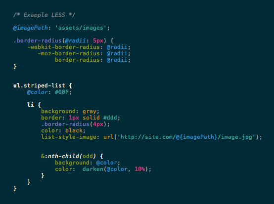

Kickass LESS Syntax
===================
#### a syntax mode for [Coda](http://panic.com/coda) & [SubEthaEdit](http://www.subethaedit.net/) ####

Installation
------------
1. Extract to `~/Library/Application Support/Coda/Modes/LESS.mode`
2. Restart your code editor

Example
----------

*Example using [Solarized](http://ethanschoonover.com/solarized) Colors*

Features
--------
Kickass LESS Syntax detects:

* CSS Rules: `@import`, `@media`, `!important`

* Selectors
	* CSS Selectors: `#id`, `.class`
	* HTML Elements: `body`, `div`, etc.
	* Pseudo Selectors: `:hover`, `::before`, `:nth-child()`, etc.
	* Operators: `&`,`*`, `>`, `+`, `~`

* Variables
	* Standard: `@var` 
	* Definitions: `@var: 2;`
	* Interpolated: `"@{var}"`

* Mixins: `.mixin();`, `.mixin;`

* JavaScript: `` `"@{str}".toUpperCase();` ``

Notes for contributors
------------------------------------

This syntax mode is based on the [SubEthaEdit Mode File Format](http://www.codingmonkeys.de/subethaedit/mode.html). Read the [documentation](http://www.codingmonkeys.de/subethaedit/mode.html) to learn about the structure and syntax.

###Regular Expressions###
*	Flavor: Ruby
*	Escape: \
*	Multiline, With Capture Groups

Credits
-------

Original work by [Jose Prado](http://pradador.com/).  This copy forked by [Gavin Elster](https://github.com/elstgav) from [Jake Strawn's version](https://github.com/himerus/LESS.mode).